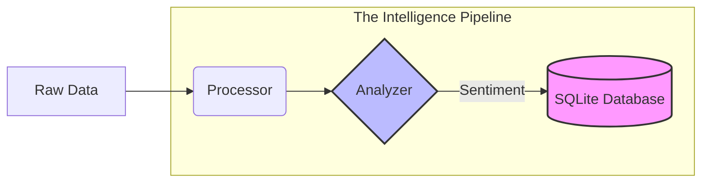

Marketing Automation Engine:
Development Progress Report

Overview

This document tracks the evolution of the Marketing Automation Engine, an end-to-end
data pipeline designed to ingest, process, and persist marketing-related intelligence. This
project demonstrates proficiency in data engineering, version control, and system
architecture.

Day 1: Foundation & Ingestion
Core Objective: Implement a robust data harvesting system.
Key Accomplishments:
Designed a dynamic file-discovery system using glob to ingest the latest
available data batches.
Implemented automated filtering logic to extract relevant industry
keywords ("AI", "Marketing", etc.).
Established a professional workflow using Git/GitHub, ensuring code
base stability through proper branching and repository management.

Day 2: Persistence & Engineering Professionalism
Core Objective: Move from ephemeral JSON storage to a structured, queryable
database layer.
Key Accomplishments:
Database Architecture:
Designed a relational schema to persist
headline data, ensuring long-term data accessibility.
Service-Oriented Design:
Created db_manager.py as a dedicated
database abstraction layer, decoupling data storage logic from processing
logic.
Data Integrity & Security:
Implemented parameterized SQL queries to
prevent security vulnerabilities and utilized context managers to ensure
safe database connections.
Workflow Optimization:
Configured .gitignore to maintain a clean
repository by excluding binary data, caches, and environment-specific
artifacts.
Version Control Discipline:
Successfully adopted feature branching and
documented commit history to reflect professional engineering standards.

Technical Stack

Language: Python 3
Storage: SQLite (Persistence Layer)
Version Control: Git/GitHub
Architecture: Modular, service-oriented pipeline

Next Development Phase
Sentiment Analysis: Integrate NLP models to categorize data and refine content
qualification.
Intelligence Filtering: Apply strategic filtering based on sentiment scores to
ensure brand safety and content relevance for marketing automation.
