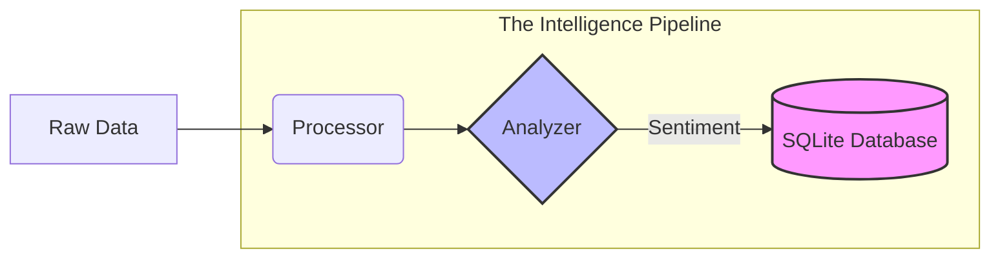

Marketing Automation Engine:
Development Progress Report

# Marketing Automation Engine

## Overview
The Marketing Automation Engine is an end-to-end data pipeline designed to ingest, validate, and analyze market intelligence in real-time. This project demonstrates expertise in data engineering, NLP-driven sentiment analysis, and modular system architecture.

---

## Project Evolution Timeline

### Day 1: Foundation & Ingestion
* **Objective:** Implement a robust data harvesting system.
* **Achievements:** * Designed dynamic file-discovery using `glob` to ingest batch data.
    * Implemented keyword-based filtering logic for industry-specific relevance.
    * Established a professional Git/GitHub workflow.

### Day 2: Persistence & Engineering Professionalism
* **Objective:** Transition from ephemeral JSON storage to a structured, queryable database.
* **Achievements:**
    * **Database Architecture:** Designed a relational schema for long-term data accessibility.
    * **Service-Oriented Design:** Created `db_manager.py` to decouple storage logic from processing logic.
    * **Data Integrity:** Implemented parameterized SQL queries to ensure security and robust connection handling.

### Day 3: Intelligence Enrichment & Data Migration
* **Objective:** Transform raw, unstructured text into actionable intelligence via NLP.
* **Achievements:**
    * **Sentiment Integration:** Integrated **FinBERT** to calculate emotional intent (Positive/Neutral/Negative).
    * **Data Enrichment:** Expanded the schema to persist sentiment scores as quantitative intelligence.
    * **The Backfill Strategy:** Implemented a non-destructive migration script to enrich historical data without loss.

### Day 4: Dashboard & Pipeline Enhancements
* **Objective:** Improve analytical visualization and system interactivity.
* **Achievements:**
    * **Data Integrity:** Added duplicate handling and strict timestamp validation.
    * **Analytical Visualization:** Shifted to daily sentiment trend aggregation.
    * **On-Demand Pipeline:** Added a "Refresh" button in Streamlit to trigger backend harvesters from the browser.

---

## Technical Highlights
* **NLP Pipeline:** Deployment of transformer models for contextual financial sentiment analysis.
* **Performance Engineering:** Vectorized processing and batch insertion (`executemany`) for high-throughput data operations.
* **Modular Design:** Service-oriented architecture with decoupled database and processing modules.
* **Data Integrity:** Multi-stage validation layer ensuring schema and logical constraint compliance.

## System Architecture

| Stage | Capability |
| :--- | :--- |
| **Ingestion** | Harvester reads raw data from diverse sources. |
| **Validation** | Duplicate removal and strict data type casting. |
| **Enrichment** | FinBERT Transformer model generates sentiment scores. |
| **Processing** | Vectorized keyword filtering and trend aggregation. |
| **Storage** | Transactional bulk insertion with historical backfill support. |
| **Presentation** | Interactive Streamlit dashboard with live refreshes. |

## Technical Stack
* **Language:** Python 3
* **Intelligence:** Transformers (FinBERT), PyTorch
* **Storage:** SQLite
* **UI/Dashboard:** Streamlit
* **Version Control:** Git/GitHub

---
*Built for scale, precision, and performance.*g automation.
